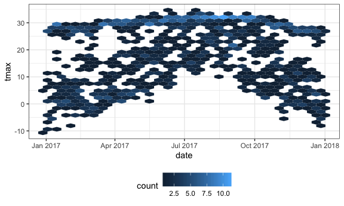

ggplot
================
Qimin Zhang
9/26/2019

# Lecture 1

``` r
weather_df = 
  rnoaa::meteo_pull_monitors(c("USW00094728", "USC00519397", "USS0023B17S"),
                      var = c("PRCP", "TMIN", "TMAX"), 
                      date_min = "2017-01-01",
                      date_max = "2017-12-31") %>%
  mutate(
    name = recode(id, USW00094728 = "CentralPark_NY", 
                      USC00519397 = "Waikiki_HA",
                      USS0023B17S = "Waterhole_WA"),
    tmin = tmin / 10,
    tmax = tmax / 10) %>%
  select(name, id, everything())
weather_df
## # A tibble: 1,095 x 6
##    name           id          date        prcp  tmax  tmin
##    <chr>          <chr>       <date>     <dbl> <dbl> <dbl>
##  1 CentralPark_NY USW00094728 2017-01-01     0   8.9   4.4
##  2 CentralPark_NY USW00094728 2017-01-02    53   5     2.8
##  3 CentralPark_NY USW00094728 2017-01-03   147   6.1   3.9
##  4 CentralPark_NY USW00094728 2017-01-04     0  11.1   1.1
##  5 CentralPark_NY USW00094728 2017-01-05     0   1.1  -2.7
##  6 CentralPark_NY USW00094728 2017-01-06    13   0.6  -3.8
##  7 CentralPark_NY USW00094728 2017-01-07    81  -3.2  -6.6
##  8 CentralPark_NY USW00094728 2017-01-08     0  -3.8  -8.8
##  9 CentralPark_NY USW00094728 2017-01-09     0  -4.9  -9.9
## 10 CentralPark_NY USW00094728 2017-01-10     0   7.8  -6  
## # … with 1,085 more rows
```

Create a ggplot.

``` r
ggplot(weather_df, aes(x = tmin, y = tmax)) +
  geom_point()
```


Alternative way to make this plot.

``` r
weather_df %>%
  ggplot(aes(x = tmin, y = tmax)) +
    geom_point()
```


Saving initial plots, mostly I don’t do this.

``` r
scatterplot = 
  weather_df %>%
  ggplot(aes(x = tmin, y = tmax)) +
    geom_point()

scatterplot
```


Adding color…

``` r
weather_df %>%
  ggplot(aes(x = tmin, y = tmax)) +
    geom_point(aes(color = name), alpha = .4)
```


Why do ‘aes’ positions matter? If I use ‘color =’ in a global scale,
then all plots in this graph would be influenced.

``` r
weather_df %>%
  ggplot(aes(x = tmin, y = tmax, color = name)) +
    geom_point(alpha = .4) +
    geom_smooth(se = FALSE)
```


Facet\!

``` r
weather_df %>%
  ggplot(aes(x = tmin, y = tmax, color = name)) +
    geom_point(alpha = .4) +
    geom_smooth(se = FALSE) +
    facet_grid(. ~ name)
```


Let’s make some interesting plots.

``` r
ggplot(weather_df, aes(x = date, y = tmax, color = name)) + 
  geom_point(aes(size = prcp), alpha = .5) +
  geom_smooth(se = FALSE)
```


``` r
ggplot(weather_df, aes(x = date, y = tmax, color = name)) + 
  geom_point(aes(size = prcp), alpha = .5) +
  geom_smooth(se = FALSE) + 
  facet_grid(. ~ name)
```


Only showing the smooth curve?

``` r
ggplot(weather_df, aes(x = date, y = tmax, color = name)) + 
  geom_smooth(se = FALSE) 
```


``` r
ggplot(weather_df, aes(x = date, y = tmax)) + 
  geom_hex()
```


More kinds of plots.

``` r
#Histogram
ggplot(weather_df, aes(x = tmax, fill = name)) + 
  geom_histogram()
```


``` r
ggplot(weather_df, aes(x = tmax, fill = name)) + 
  geom_histogram(position = "dodge", binwidth = 2)
```


``` r
#Density plot
ggplot(weather_df, aes(x = tmax, fill = name)) + 
  geom_density(alpha = .4, adjust = .5, color = "blue")
```


``` r
#Boxplot
ggplot(weather_df, aes(x = name, y = tmax)) + 
  geom_boxplot()
```


``` r
#Violin plot
ggplot(weather_df, aes(x = name, y = tmax)) + 
  geom_violin(aes(fill = name), color = "blue", alpha = .5) + 
  stat_summary(fun.y = median, geom = "point", color = "blue", size = 4)
```


``` r
#Ridge plot
ridge_temp =
  ggplot(weather_df, aes(x = tmax, y = name)) + 
    geom_density_ridges(scale = .85)
ggsave("gglpot_tmp_riage.pdf", ridge_temp)
```

# Lecture 2

Labels and ticks.

``` r
weather_df %>% 
  ggplot(aes(x = tmin, y = tmax)) + 
  geom_point(aes(color = name), alpha = .5) +
  labs(
    title = "Temperature plot",
    x = "Minimum Temp",
    y = "Maximum Temp",
    caption = "Data from the rnoaa package"
  ) +
  scale_x_continuous(
    breaks = c(-15, -5, 20),
    labels = c("-15", "-5", "20")
  )
```

    ## Warning: Removed 15 rows containing missing values (geom_point).


``` r
weather_df %>% 
  ggplot(aes(x = tmin, y = tmax)) + 
  geom_point(aes(color = name), alpha = .5) +
  labs(
    title = "Temperature plot",
    x = "Minimum Temp",
    y = "Maximum Temp",
    caption = "Data from the rnoaa package"
  ) +
  scale_x_continuous(
    breaks = c(-15, -5, 20),
    labels = c("-15", "-5", "20")
  ) +
  scale_y_continuous(
    trans = "sqrt", 
    position = "right")
```

    ## Warning in self$trans$transform(x): NaNs produced

    ## Warning: Transformation introduced infinite values in continuous y-axis

    ## Warning: Removed 90 rows containing missing values (geom_point).


``` r
# or scale_y_sqrt()
```

Colors and themes.

``` r
weather_df %>% 
  ggplot(aes(x = tmin, y = tmax)) + 
  geom_point(aes(color = name), alpha = .5) + 
  labs(
    title = "Temperature plot",
    x = "Minimum daily temperature (C)",
    y = "Maxiumum daily temperature (C)",
    caption = "Data from the rnoaa package") + 
  scale_color_hue(name = "Location", h = c(100, 300))
```

    ## Warning: Removed 15 rows containing missing values (geom_point).


``` r
gg_temp_plot = 
  weather_df %>% 
  ggplot(aes(x = tmin, y = tmax)) + 
  geom_point(aes(color = name), alpha = .5) + 
  labs(
    title = "Temperature plot",
    x = "Minimum daily temperature (C)",
    y = "Maxiumum daily temperature (C)",
    caption = "Data from the rnoaa package"
  ) + 
  viridis::scale_color_viridis(
    name = "Location", 
    discrete = TRUE
  )

gg_temp_plot
```

    ## Warning: Removed 15 rows containing missing values (geom_point).


``` r
gg_temp_plot + 
  theme_minimal() + 
  theme(legend.position = "bottom")
```

    ## Warning: Removed 15 rows containing missing values (geom_point).


``` r
#Don't reverse the order!
```
