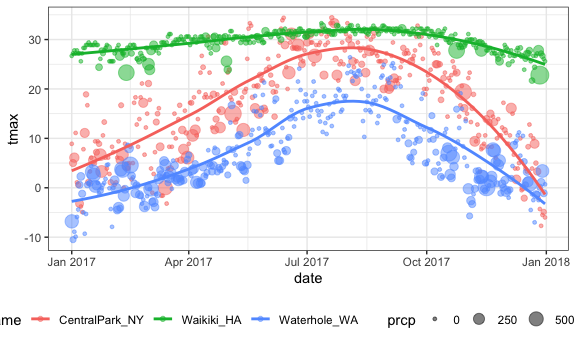
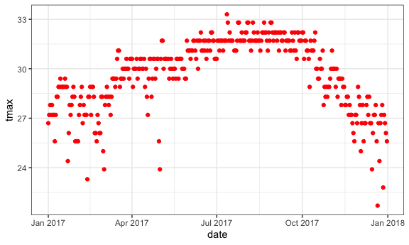
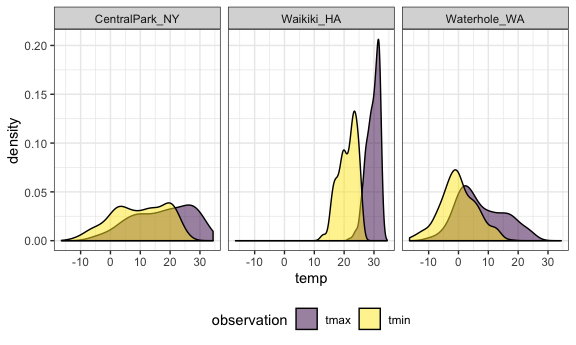

ggplot
================
Qimin Zhang
9/26/2019

# Lecture 1

``` r
weather_df = 
  rnoaa::meteo_pull_monitors(c("USW00094728", "USC00519397", "USS0023B17S"),
                      var = c("PRCP", "TMIN", "TMAX"), 
                      date_min = "2017-01-01",
                      date_max = "2017-12-31") %>%
  mutate(
    name = recode(id, USW00094728 = "CentralPark_NY", 
                      USC00519397 = "Waikiki_HA",
                      USS0023B17S = "Waterhole_WA"),
    tmin = tmin / 10,
    tmax = tmax / 10) %>%
  select(name, id, everything())
weather_df
## # A tibble: 1,095 x 6
##    name           id          date        prcp  tmax  tmin
##    <chr>          <chr>       <date>     <dbl> <dbl> <dbl>
##  1 CentralPark_NY USW00094728 2017-01-01     0   8.9   4.4
##  2 CentralPark_NY USW00094728 2017-01-02    53   5     2.8
##  3 CentralPark_NY USW00094728 2017-01-03   147   6.1   3.9
##  4 CentralPark_NY USW00094728 2017-01-04     0  11.1   1.1
##  5 CentralPark_NY USW00094728 2017-01-05     0   1.1  -2.7
##  6 CentralPark_NY USW00094728 2017-01-06    13   0.6  -3.8
##  7 CentralPark_NY USW00094728 2017-01-07    81  -3.2  -6.6
##  8 CentralPark_NY USW00094728 2017-01-08     0  -3.8  -8.8
##  9 CentralPark_NY USW00094728 2017-01-09     0  -4.9  -9.9
## 10 CentralPark_NY USW00094728 2017-01-10     0   7.8  -6  
## # … with 1,085 more rows
```

Create a ggplot.

``` r
ggplot(weather_df, aes(x = tmin, y = tmax)) +
  geom_point()
```


Alternative way to make this plot.

``` r
weather_df %>%
  ggplot(aes(x = tmin, y = tmax)) +
    geom_point()
```


Saving initial plots, mostly I don’t do this.

``` r
scatterplot = 
  weather_df %>%
  ggplot(aes(x = tmin, y = tmax)) +
    geom_point()

scatterplot
```


Adding color…

``` r
weather_df %>%
  ggplot(aes(x = tmin, y = tmax)) +
    geom_point(aes(color = name), alpha = .4)
```


Why do ‘aes’ positions matter? If I use ‘color =’ in a global scale,
then all plots in this graph would be influenced.

``` r
weather_df %>%
  ggplot(aes(x = tmin, y = tmax, color = name)) +
    geom_point(alpha = .4) +
    geom_smooth(se = FALSE)
```


Facet\!

``` r
weather_df %>%
  ggplot(aes(x = tmin, y = tmax, color = name)) +
    geom_point(alpha = .4) +
    geom_smooth(se = FALSE) +
    facet_grid(. ~ name)
```


Let’s make some interesting plots.

``` r
ggplot(weather_df, aes(x = date, y = tmax, color = name)) + 
  geom_point(aes(size = prcp), alpha = .5) +
  geom_smooth(se = FALSE)
```



``` r
ggplot(weather_df, aes(x = date, y = tmax, color = name)) + 
  geom_point(aes(size = prcp), alpha = .5) +
  geom_smooth(se = FALSE) + 
  facet_grid(. ~ name)
```


Only showing the smooth curve?

``` r
ggplot(weather_df, aes(x = date, y = tmax, color = name)) + 
  geom_smooth(se = FALSE) 
```


``` r
ggplot(weather_df, aes(x = date, y = tmax)) + 
  geom_hex()
```


More kinds of plots.

``` r
#Histogram
ggplot(weather_df, aes(x = tmax, fill = name)) + 
  geom_histogram()
```


``` r
ggplot(weather_df, aes(x = tmax, fill = name)) + 
  geom_histogram(position = "dodge", binwidth = 2)
```


``` r
#Density plot
ggplot(weather_df, aes(x = tmax, fill = name)) + 
  geom_density(alpha = .4, adjust = .5, color = "blue")
```


``` r
#Boxplot
ggplot(weather_df, aes(x = name, y = tmax)) + 
  geom_boxplot()
```


``` r
#Violin plot
ggplot(weather_df, aes(x = name, y = tmax)) + 
  geom_violin(aes(fill = name), color = "blue", alpha = .5) + 
  stat_summary(fun.y = median, geom = "point", color = "blue", size = 4)
```


``` r
#Ridge plot
ridge_temp =
  ggplot(weather_df, aes(x = tmax, y = name)) + 
    geom_density_ridges(scale = .85)
ggsave("gglpot_tmp_riage.pdf", ridge_temp)
```

# Lecture 2

Labels and ticks.

``` r
weather_df %>% 
  ggplot(aes(x = tmin, y = tmax)) + 
  geom_point(aes(color = name), alpha = .5) +
  labs(
    title = "Temperature plot",
    x = "Minimum Temp",
    y = "Maximum Temp",
    caption = "Data from the rnoaa package"
  ) +
  scale_x_continuous(
    breaks = c(-15, -5, 20),
    labels = c("-15", "-5", "20")
  )
```


``` r
weather_df %>% 
  ggplot(aes(x = tmin, y = tmax)) + 
  geom_point(aes(color = name), alpha = .5) +
  labs(
    title = "Temperature plot",
    x = "Minimum Temp",
    y = "Maximum Temp",
    caption = "Data from the rnoaa package"
  ) +
  scale_x_continuous(
    breaks = c(-15, -5, 20),
    labels = c("-15", "-5", "20")
  ) +
  scale_y_continuous(
    trans = "sqrt", 
    position = "right")
```

    ## Warning in self$trans$transform(x): NaNs produced

    ## Warning: Transformation introduced infinite values in continuous y-axis

    ## Warning: Removed 90 rows containing missing values (geom_point).


or scale\_y\_sqrt().

Colors and themes.

``` r
weather_df %>% 
  ggplot(aes(x = tmin, y = tmax)) + 
  geom_point(aes(color = name), alpha = .5) + 
  labs(
    title = "Temperature plot",
    x = "Minimum daily temperature (C)",
    y = "Maxiumum daily temperature (C)",
    caption = "Data from the rnoaa package") + 
  scale_color_hue(name = "Location", h = c(100, 300))
```


``` r
gg_temp_plot = 
  weather_df %>% 
  ggplot(aes(x = tmin, y = tmax)) + 
  geom_point(aes(color = name), alpha = .5) + 
  labs(
    title = "Temperature plot",
    x = "Minimum daily temperature (C)",
    y = "Maxiumum daily temperature (C)",
    caption = "Data from the rnoaa package"
  ) + 
  viridis::scale_color_viridis(
    name = "Location", 
    discrete = TRUE
  )

gg_temp_plot
```


``` r
gg_temp_plot + 
  theme_minimal() + 
  theme(legend.position = "bottom")
```


Don’t reverse the order\!

More than one dataset.

``` r
central_park = 
  weather_df %>% 
  filter(name == "CentralPark_NY")

waikiki = 
  weather_df %>% 
  filter(name == "Waikiki_HA")

ggplot(data = waikiki, aes(x = date, y = tmax, color = name)) + 
  geom_point() + 
  geom_line(data = central_park)
```

    ## Warning: Removed 3 rows containing missing values (geom_point).


To assign plot of sigle dataset color.

``` r
waikiki %>%
  ggplot(aes(x = date, y = tmax)) +
  geom_point(color = "red")
```

    ## Warning: Removed 3 rows containing missing values (geom_point).



``` r
library(patchwork)

tmax_tmin_p = 
  weather_df %>% 
  ggplot(aes(x = tmax, y = tmin, color = name)) + 
  geom_point(alpha = .5) +
  theme(legend.position = "none")

prcp_dens_p = 
  weather_df %>% 
  filter(prcp > 0) %>% 
  ggplot(aes(x = prcp, fill = name)) + 
  geom_density(alpha = .5) + 
  theme(legend.position = "none")

tmax_date_p = 
  weather_df %>% 
  ggplot(aes(x = date, y = tmax, color = name)) + 
  geom_point(alpha = .5) +
  geom_smooth(se = FALSE) + 
  theme(legend.position = "bottom")

(tmax_tmin_p + prcp_dens_p) / tmax_date_p
```

    ## `geom_smooth()` using method = 'loess' and formula 'y ~ x'


Data manipulation.

``` r
weather_df %>%
  mutate(name = forcats::fct_relevel(name, c("Waikiki_HA", "CentralPark_NY", "Waterhole_WA"))) %>% 
  ggplot(aes(x = name, y = tmax)) + 
  geom_boxplot(aes(fill = name), color = "blue", alpha = .5) + 
  theme(legend.position = "bottom")
```


``` r
weather_df %>%
  mutate(
    name = factor(name),
    name = reorder(name, tmin)
    ) %>% 
  ggplot(aes(x = name, y = tmax)) + 
  geom_boxplot(aes(fill = name), color = "blue", alpha = .5) + 
  theme(legend.position = "bottom")
```


``` r
weather_df %>%
  select(name, tmax, tmin) %>% 
  pivot_longer(
    tmax:tmin,
    names_to = "observation", 
    values_to = "temp") %>% 
  ggplot(aes(x = temp, fill = observation)) +
  geom_density(alpha = .5) + 
  facet_grid(~name) + 
  viridis::scale_fill_viridis(discrete = TRUE)
```



``` r
pup_data = 
  read_csv("../data_wrangling_1/data_wrangling_1/data_import_examples//FAS_pups.csv", col_types = "ciiiii") %>%
  janitor::clean_names() %>%
  mutate(sex = recode(sex, `1` = "male", `2` = "female")) 

litter_data = 
  read_csv("../data_wrangling_1/data_wrangling_1/data_import_examples//FAS_litters.csv", col_types = "ccddiiii") %>%
  janitor::clean_names() %>%
  select(-pups_survive) %>%
  separate(group, into = c("dose", "day_of_tx"), sep = 3) %>%
  mutate(wt_gain = gd18_weight - gd0_weight,
         day_of_tx = as.numeric(day_of_tx))

fas_data = left_join(pup_data, litter_data, by = "litter_number") 

fas_data %>% 
  select(sex, dose, day_of_tx, pd_ears:pd_walk) %>% 
  pivot_longer(
    pd_ears:pd_walk,
    names_to = "outcome", 
    values_to = "pn_day") %>% 
  drop_na() %>% 
  mutate(outcome = forcats::fct_reorder(outcome, day_of_tx, median)) %>% 
  ggplot(aes(x = dose, y = pn_day)) + 
  geom_violin() + 
  facet_grid(day_of_tx ~ outcome)
```


\# Lecture 3 Create the weather data by month.

``` r
weather_df = 
  rnoaa::meteo_pull_monitors(c("USW00094728", "USC00519397", "USS0023B17S"),
                      var = c("PRCP", "TMIN", "TMAX"), 
                      date_min = "2017-01-01",
                      date_max = "2017-12-31") %>%
  mutate(
    name = recode(id, USW00094728 = "CentralPark_NY", 
                      USC00519397 = "Waikiki_HA",
                      USS0023B17S = "Waterhole_WA"),
    tmin = tmin / 10,
    tmax = tmax / 10,
    month = lubridate::floor_date(date, unit = "month")) %>%
  select(name, id, date, month, everything())
```

Group by yand counting.

``` r
weather_df %>%
  group_by(name, month)
```

    ## # A tibble: 1,095 x 7
    ## # Groups:   name, month [36]
    ##    name           id          date       month       prcp  tmax  tmin
    ##    <chr>          <chr>       <date>     <date>     <dbl> <dbl> <dbl>
    ##  1 CentralPark_NY USW00094728 2017-01-01 2017-01-01     0   8.9   4.4
    ##  2 CentralPark_NY USW00094728 2017-01-02 2017-01-01    53   5     2.8
    ##  3 CentralPark_NY USW00094728 2017-01-03 2017-01-01   147   6.1   3.9
    ##  4 CentralPark_NY USW00094728 2017-01-04 2017-01-01     0  11.1   1.1
    ##  5 CentralPark_NY USW00094728 2017-01-05 2017-01-01     0   1.1  -2.7
    ##  6 CentralPark_NY USW00094728 2017-01-06 2017-01-01    13   0.6  -3.8
    ##  7 CentralPark_NY USW00094728 2017-01-07 2017-01-01    81  -3.2  -6.6
    ##  8 CentralPark_NY USW00094728 2017-01-08 2017-01-01     0  -3.8  -8.8
    ##  9 CentralPark_NY USW00094728 2017-01-09 2017-01-01     0  -4.9  -9.9
    ## 10 CentralPark_NY USW00094728 2017-01-10 2017-01-01     0   7.8  -6  
    ## # … with 1,085 more rows

``` r
weather_df %>%
  group_by(month) %>%
  summarize(n_obs = n(),
            n_unique = n_distinct(date))
```

    ## # A tibble: 12 x 3
    ##    month      n_obs n_unique
    ##    <date>     <int>    <int>
    ##  1 2017-01-01    93       31
    ##  2 2017-02-01    84       28
    ##  3 2017-03-01    93       31
    ##  4 2017-04-01    90       30
    ##  5 2017-05-01    93       31
    ##  6 2017-06-01    90       30
    ##  7 2017-07-01    93       31
    ##  8 2017-08-01    93       31
    ##  9 2017-09-01    90       30
    ## 10 2017-10-01    93       31
    ## 11 2017-11-01    90       30
    ## 12 2017-12-01    93       31

``` r
weather_df %>%
  count(name, month) %>%
  knitr::kable()
```

| name            | month      |  n |
| :-------------- | :--------- | -: |
| CentralPark\_NY | 2017-01-01 | 31 |
| CentralPark\_NY | 2017-02-01 | 28 |
| CentralPark\_NY | 2017-03-01 | 31 |
| CentralPark\_NY | 2017-04-01 | 30 |
| CentralPark\_NY | 2017-05-01 | 31 |
| CentralPark\_NY | 2017-06-01 | 30 |
| CentralPark\_NY | 2017-07-01 | 31 |
| CentralPark\_NY | 2017-08-01 | 31 |
| CentralPark\_NY | 2017-09-01 | 30 |
| CentralPark\_NY | 2017-10-01 | 31 |
| CentralPark\_NY | 2017-11-01 | 30 |
| CentralPark\_NY | 2017-12-01 | 31 |
| Waikiki\_HA     | 2017-01-01 | 31 |
| Waikiki\_HA     | 2017-02-01 | 28 |
| Waikiki\_HA     | 2017-03-01 | 31 |
| Waikiki\_HA     | 2017-04-01 | 30 |
| Waikiki\_HA     | 2017-05-01 | 31 |
| Waikiki\_HA     | 2017-06-01 | 30 |
| Waikiki\_HA     | 2017-07-01 | 31 |
| Waikiki\_HA     | 2017-08-01 | 31 |
| Waikiki\_HA     | 2017-09-01 | 30 |
| Waikiki\_HA     | 2017-10-01 | 31 |
| Waikiki\_HA     | 2017-11-01 | 30 |
| Waikiki\_HA     | 2017-12-01 | 31 |
| Waterhole\_WA   | 2017-01-01 | 31 |
| Waterhole\_WA   | 2017-02-01 | 28 |
| Waterhole\_WA   | 2017-03-01 | 31 |
| Waterhole\_WA   | 2017-04-01 | 30 |
| Waterhole\_WA   | 2017-05-01 | 31 |
| Waterhole\_WA   | 2017-06-01 | 30 |
| Waterhole\_WA   | 2017-07-01 | 31 |
| Waterhole\_WA   | 2017-08-01 | 31 |
| Waterhole\_WA   | 2017-09-01 | 30 |
| Waterhole\_WA   | 2017-10-01 | 31 |
| Waterhole\_WA   | 2017-11-01 | 30 |
| Waterhole\_WA   | 2017-12-01 | 31 |
| 2\*2 tables     |            |    |

``` r
weather_df %>%
  mutate(
    cold = case_when(
      tmax < 5 ~"cold",
      tmin > 25 ~ "hot",
      TRUE ~ ""
    )
  ) %>%
  group_by(name, cold) %>%
  count() %>%
  filter(name != "Waikiki_HA") %>% 
  janitor::tabyl(name, cold)
```

    ##            name V1 cold
    ##  CentralPark_NY  1    1
    ##    Waterhole_WA  1    1

General summaries.

``` r
weather_df %>%
  drop_na() %>%
  group_by(name, month) %>%
  summarize(
    mean_tmax = mean(tmax),
    mean_prec = mean(prcp, na.rm = TRUE),
    median_tmax = median(tmax),
    sd_tmax = sd(tmax)
  ) %>%
  ggplot(aes(x = month, y = mean_tmax, color = name)) + 
    geom_point() + geom_line() + 
    theme(legend.position = "bottom")
```


``` r
weather_df %>%
  drop_na() %>%
  group_by(name, month) %>%
  summarize(mean_tmax = mean(tmax)) %>% 
  pivot_wider(
    names_from = name,
    values_from = mean_tmax) %>% 
  knitr::kable(digits = 1)
```

| month      | CentralPark\_NY | Waikiki\_HA | Waterhole\_WA |
| :--------- | --------------: | ----------: | ------------: |
| 2017-01-01 |             6.0 |        27.8 |         \-1.4 |
| 2017-02-01 |             9.3 |        27.2 |           0.0 |
| 2017-03-01 |             8.2 |        29.1 |           1.7 |
| 2017-04-01 |            18.3 |        29.8 |           3.9 |
| 2017-05-01 |            20.1 |        30.1 |          10.1 |
| 2017-06-01 |            26.3 |        31.3 |          12.9 |
| 2017-07-01 |            28.7 |        31.8 |          16.3 |
| 2017-08-01 |            27.2 |        32.0 |          19.6 |
| 2017-09-01 |            25.4 |        31.7 |          14.2 |
| 2017-10-01 |            21.8 |        30.2 |           8.3 |
| 2017-11-01 |            12.3 |        28.4 |           1.4 |
| 2017-12-01 |             4.5 |        26.5 |           2.2 |
